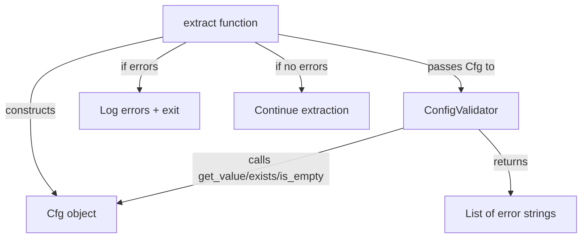
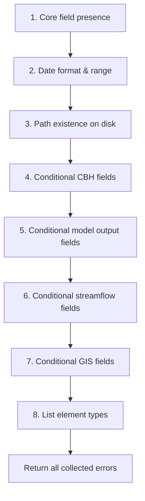

# Design Document: Config Validation

## Overview

This feature introduces a `ConfigValidator` class in a new module `Bandit/config_validator.py` that performs comprehensive, early validation of the Bandit YAML configuration before any heavy processing begins. The validator is invoked in the `extract` function immediately after the `Cfg` object is constructed and before any `ParamDb`, `ControlFile`, `Cbh`, or network operations.

The validator collects all errors across all checks and reports them in a single pass, so the modeler can fix every issue at once rather than iterating through one failure at a time.

### Design Decisions

1. **Separate module**: The validator lives in its own module (`Bandit/config_validator.py`) rather than being embedded in `bandit_cfg.py` or `bandit.py`. This keeps validation logic decoupled from both the config-loading mechanism and the extraction workflow, making it independently testable.

2. **Operates on the `Cfg` instance**: The validator accepts a `Cfg` object and calls its existing `get_value` / `exists` / `is_empty` methods. This avoids duplicating config-access logic and respects the existing default-value fallback behavior in `Cfg`.

3. **Error accumulation pattern**: Rather than raising on the first failure, the validator accumulates a list of error strings and returns them. The caller (`extract`) decides how to log and exit. This keeps the validator a pure function of config state → error list, which is easy to test.

4. **No changes to `Cfg` class**: The existing `Cfg` class is not modified. The validator is a consumer of `Cfg`, not an extension of it.

## Architecture



The validation flow within `ConfigValidator.validate()` follows a fixed order:



All steps run regardless of earlier failures — errors are accumulated, not short-circuited. The one exception is that path-existence checks (step 3) skip fields that were already flagged as missing/empty in step 1, since checking a path for an empty string is meaningless.

## Components and Interfaces

### `ConfigValidator` class

**Module**: `Bandit/config_validator.py`

```python
class ConfigValidator:
    """Validates a Bandit Cfg object before extraction begins."""

    def __init__(self, config: Cfg):
        """
        :param config: A loaded Cfg instance to validate.
        """

    def validate(self) -> List[str]:
        """Run all validation checks and return a list of error messages.

        Returns an empty list if the configuration is valid.
        """

    # --- Internal validation methods (all append to self._errors) ---

    def _validate_core_fields(self) -> Set[str]:
        """Check that core required fields are present and non-empty.
        Returns the set of field names that failed (used to skip
        downstream path checks on those fields).
        """

    def _validate_dates(self) -> None:
        """Check date format (YYYY-MM-DD) and that start_date < end_date."""

    def _validate_paths(self, skip_fields: Set[str]) -> None:
        """Check that required paths exist on disk.
        Skips any field in skip_fields (already flagged as missing).
        Checks cbh_dir only when output_cbh is true.
        """

    def _validate_cbh_fields(self) -> None:
        """When output_cbh is true, check cbh_dir and cbh_var_map."""

    def _validate_model_output_fields(self) -> None:
        """When include_model_output is true, check output_vars_dir and output_vars."""

    def _validate_streamflow_fields(self) -> None:
        """When output_streamflow is true, check streamflow_filename."""

    def _validate_gis_fields(self) -> None:
        """When output_shapefiles is true, check gis structure."""

    def _validate_list_types(self) -> None:
        """Check that outlets, cutoffs, hru_noroute contain only integers."""
```

### Integration point in `extract`

A small block is added to `Bandit/bandit.py` after `config = bc.Cfg(config_file)` and before any other processing:

```python
from Bandit.config_validator import ConfigValidator

# ... inside extract(), after config = bc.Cfg(config_file):
validator = ConfigValidator(config)
errors = validator.validate()
if errors:
    for err in errors:
        bandit_log.error(err)
        con.print(f'[red]ERROR[/]: {err}')
    con.print(f'[red]Configuration has {len(errors)} error(s). Fix the above issues and retry.[/]')
    exit(2)
```

### Public interface summary

| Component | Method | Input | Output |
|---|---|---|---|
| `ConfigValidator.__init__` | constructor | `Cfg` instance | — |
| `ConfigValidator.validate` | run all checks | — | `List[str]` (error messages) |

No other public methods are exposed. The internal `_validate_*` methods are implementation details.

## Data Models

The validator does not introduce new data models. It operates on the existing `Cfg` object and the `default_values` dictionary defined in `bandit_cfg.py`.

### Configuration field classification

| Category | Fields | Validation |
|---|---|---|
| Core required (always) | `output_dir`, `param_filename`, `paramdb_dir`, `control_filename`, `start_date`, `end_date` | Present and non-empty |
| Date fields | `start_date`, `end_date` | YYYY-MM-DD format, start < end |
| Path fields (always) | `paramdb_dir` (dir), `control_filename` (file) | Exists on disk |
| Path fields (conditional) | `cbh_dir` (file or dir) | Exists on disk when `output_cbh` is true |
| Conditional: CBH | `cbh_dir`, `cbh_var_map` | Non-empty when `output_cbh` is true |
| Conditional: Model output | `output_vars_dir`, `output_vars` | Non-empty when `include_model_output` is true |
| Conditional: Streamflow | `streamflow_filename` | Non-empty when `output_streamflow` is true |
| Conditional: GIS | `gis`, `gis[src_filename]`, `gis[dst_extension]`, `gis[layers]` | Non-empty dict with required keys when `output_shapefiles` is true |
| List type checks | `outlets`, `cutoffs`, `hru_noroute` | All elements are integers |

### Error message format

Each error message is a plain string following one of these patterns:

- `"Required field '{name}' is missing or empty"`
- `"Field '{name}' has invalid date format '{value}'; expected YYYY-MM-DD"`
- `"'start_date' ({start}) must precede 'end_date' ({end})"`
- `"Path for '{name}' does not exist: {path}"`
- `"Field '{name}' is required when '{toggle}' is enabled"`
- `"Field '{name}' must be a non-empty dictionary when '{toggle}' is enabled"`
- `"GIS config is missing required key '{key}'"`
- `"Field '{name}' contains non-integer element: {element}"`


## Correctness Properties

*A property is a characteristic or behavior that should hold true across all valid executions of a system — essentially, a formal statement about what the system should do. Properties serve as the bridge between human-readable specifications and machine-verifiable correctness guarantees.*

### Property 1: Core field presence detection

*For any* configuration dictionary and *for any* subset of the core fields (`output_dir`, `param_filename`, `paramdb_dir`, `control_filename`, `start_date`, `end_date`) that are missing or empty, the validator SHALL return an error for each such field, and the error message SHALL contain the field name.

**Validates: Requirements 1.1, 1.2, 1.3**

### Property 2: Date format validation

*For any* string value assigned to `start_date` or `end_date`, the validator SHALL produce a date-format error if and only if the string is not parseable as a valid `YYYY-MM-DD` date. The error message SHALL contain the field name and the invalid value.

**Validates: Requirements 3.1, 3.2, 3.3**

### Property 3: Date ordering

*For any* two valid `YYYY-MM-DD` date strings assigned to `start_date` and `end_date`, the validator SHALL produce a date-ordering error if and only if `start_date >= end_date`. The error message SHALL contain both date values.

**Validates: Requirements 3.4**

### Property 4: Conditional field validation

*For any* conditional toggle (`output_cbh`, `include_model_output`, `output_streamflow`) and its associated required fields (`cbh_dir`/`cbh_var_map`, `output_vars_dir`/`output_vars`, `streamflow_filename`), the validator SHALL produce an error for a field if and only if the toggle is `true` and the field is missing or empty. When the toggle is `false`, no error SHALL be produced regardless of the field's value.

**Validates: Requirements 4.1, 4.2, 4.3, 4.4, 5.1, 5.2, 5.3, 5.4, 6.1, 6.2**

### Property 5: GIS structure validation

*For any* configuration where `output_shapefiles` is `true`, the validator SHALL produce an error if `gis` is not a non-empty dictionary, or if `gis` is missing any of the keys `src_filename`, `dst_extension`, or `layers`, or if `gis['src_filename']` is empty, or if `gis['layers']` is not a non-empty dictionary. When `output_shapefiles` is `false`, no GIS-related errors SHALL be produced.

**Validates: Requirements 7.1, 7.2, 7.3, 7.4, 7.5**

### Property 6: List element type validation

*For any* of the list fields (`outlets`, `cutoffs`, `hru_noroute`) that contain at least one element, the validator SHALL produce an error for each non-integer element. The error message SHALL name the field and identify the invalid element. If all elements are integers, no error SHALL be produced for that field.

**Validates: Requirements 8.1, 8.2, 8.3, 8.4**

### Property 7: Path existence validation

*For any* configuration where `paramdb_dir` is non-empty, the validator SHALL produce an error if the path does not exist as a directory on disk. *For any* configuration where `control_filename` is non-empty, the validator SHALL produce an error if the path does not exist as a file on disk. *For any* configuration where `output_cbh` is `true` and `cbh_dir` is non-empty, the validator SHALL produce an error if the path does not exist on disk. When a path field was already flagged as missing/empty, no path-existence error SHALL be produced for it.

**Validates: Requirements 2.1, 2.2, 2.3, 2.4**

## Error Handling

### Validation errors

The `ConfigValidator.validate()` method never raises exceptions. It returns a `List[str]` of error messages. The caller (`extract`) is responsible for:

1. Logging each error at the ERROR level via `bandit_log.error()`
2. Printing each error to the console via `con.print()` with red formatting
3. Printing a summary count of errors
4. Calling `exit(2)` to terminate with a non-zero status code

### Unexpected exceptions during validation

If an unexpected exception occurs during validation (e.g., a `Cfg` method raises), the validator lets it propagate. This is intentional — the `Cfg` class already handles its own error cases (e.g., `KeyError` for unknown config variables), and wrapping those would obscure the root cause.

### Edge cases

- **Empty config file**: All core fields will fall back to `default_values` in `Cfg`. Fields like `output_dir` and `paramdb_dir` default to `''`, so they will be caught by the core-field presence check.
- **Boolean toggles default to `False`**: Conditional checks are skipped when toggles are `False`, so an empty config won't trigger conditional-field errors.
- **YAML type coercion**: `ruamel.yaml` may parse bare values like `2024-01-01` as `datetime.date` objects rather than strings. The date validator should handle both string and `datetime.date` inputs gracefully.

## Testing Strategy

### Test framework

- **Unit tests**: `pytest` (already in dev dependencies)
- **Property-based tests**: `hypothesis` (to be added to dev dependencies)

### Property-based tests

Each correctness property maps to a single Hypothesis test. All property tests run a minimum of 100 iterations.

| Property | Test | Strategy |
|---|---|---|
| 1: Core field presence | `test_core_field_presence` | Generate random subsets of core fields to omit/empty. Verify each missing field appears in errors. |
| 2: Date format | `test_date_format_validation` | Generate random strings (valid YYYY-MM-DD, invalid formats, edge dates). Verify error iff not parseable. |
| 3: Date ordering | `test_date_ordering` | Generate random pairs of valid dates. Verify error iff start >= end. |
| 4: Conditional fields | `test_conditional_field_validation` | Generate random toggle states and field values. Verify error iff toggle=true and field empty. |
| 5: GIS structure | `test_gis_structure_validation` | Generate random gis dicts with subsets of required keys. Verify errors match missing/empty keys. |
| 6: List element types | `test_list_element_types` | Generate lists with random mixes of ints and non-ints. Verify error for each non-int element. |
| 7: Path existence | `test_path_existence_validation` | Use `tmp_path` fixture to create/omit paths. Verify error iff path doesn't exist. |

Tag format for each test: `# Feature: config-validation, Property {N}: {title}`

### Unit tests (example-based)

- **Integration smoke test**: Verify that `extract()` calls the validator before `ParamDb` (validates Req 9.1, 9.2)
- **Logging integration**: Verify errors are logged at ERROR level and printed to console (validates Req 10.2, 10.3, 10.4)
- **YAML type coercion edge case**: Verify that `datetime.date` objects from YAML are handled correctly in date validation
- **Valid config produces no errors**: A fully valid config returns an empty error list

### Test file location

`tests/test_config_validator.py`

### Configuration for Hypothesis

```python
from hypothesis import settings

@settings(max_examples=100)
```
