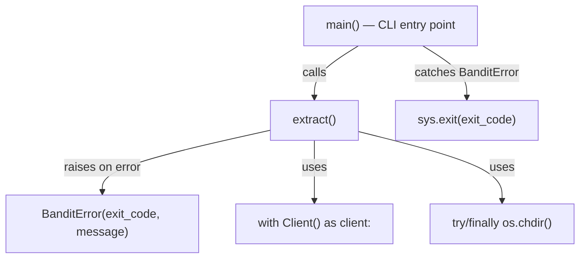

# Design Document: error-handling-cleanup

## Overview

This design replaces the six bare `exit()` calls in `Bandit/bandit.py`'s `extract()` function with raises of a custom `BanditError` exception, wraps the Dask `Client` in a context manager for guaranteed cleanup, and guards the `os.chdir()` call with `try/finally`. The CLI entry point (`main()`) catches `BanditError` and translates it into a `sys.exit()` call with the original exit code.

The scope is intentionally narrow: only `Bandit/bandit.py` and a new `Bandit/exceptions.py` module are touched. Other scripts (`bandit_by_streamgage.py`, `bandit_helpers.py`, etc.) are out of scope for this change.

### Design Decisions

1. **Separate `exceptions.py` module** — `BanditError` lives in `Bandit/exceptions.py` rather than inline in `bandit.py`. This keeps the exception importable by other modules without circular dependencies and follows standard Python packaging conventions.

2. **`with Client() as client:` context manager** — Dask's `Client` already supports the context manager protocol. Using `with` is the simplest way to guarantee `client.close()` on any exit path (normal, exception, or `BanditError`). The explicit `client.close()` at the end of the function is removed.

3. **`try/finally` for `os.chdir()`** — A `try/finally` block wrapping the body of `extract()` restores the working directory. This is simpler than writing a custom context manager for a single use site. The guard only activates when `job_dir` is provided and valid.

4. **Raise-then-catch pattern** — Each error site raises `BanditError` with the same message and exit code that the old `exit()` call used. The `main()` function catches `BanditError`, logs it, prints it, and calls `sys.exit(error.exit_code)`. This preserves all existing behavior for CLI users while making `extract()` safe to call from tests and library code.

## Architecture

The change is a refactor within a single module plus one new small module. No new external dependencies are introduced.



### Control Flow

1. `main()` calls `app()` which dispatches to `extract()`.
2. Inside `extract()`, if `job_dir` is provided and valid, `os.chdir(job_dir)` runs inside a `try` block whose `finally` restores the original directory.
3. The Dask `Client` is created with `with Client() as client:`, guaranteeing cleanup.
4. Any error condition that previously called `exit(N)` now raises `BanditError(exit_code=N, message=...)`.
5. `BanditError` propagates up through the `with` and `try/finally` blocks, triggering cleanup.
6. `main()` catches `BanditError`, logs the message, prints it to the console, and calls `sys.exit(error.exit_code)`.

## Components and Interfaces

### 1. `Bandit/exceptions.py` (new file)

```python
class BanditError(Exception):
    """Exception carrying an integer exit code for CLI translation."""

    def __init__(self, message: str, exit_code: int = 1):
        super().__init__(message)
        self.exit_code = exit_code
```

- Subclass of `Exception`.
- Stores `exit_code` as an instance attribute.
- `str(error)` returns the message via the default `Exception.__str__`.
- Default `exit_code` is `1` when not specified.

### 2. `Bandit/bandit.py` — `extract()` changes

**Imports added:**
```python
from Bandit.exceptions import BanditError
```

**Working directory guard** — wraps the function body after the `os.chdir()` decision:
```python
stdir = os.getcwd()
chdir_needed = False

if job_dir is not None:
    job_dir = Path(job_dir) if isinstance(job_dir, str) else job_dir
    if job_dir.is_dir():
        os.chdir(job_dir)
        chdir_needed = True
    else:
        con.print(f'[red]ERROR[/]: Invalid jobs directory: {str(job_dir)}')
        bandit_log.error(f'Invalid jobs directory: {str(job_dir)}')
        raise BanditError(f'Invalid jobs directory: {str(job_dir)}', exit_code=-1)

try:
    # ... entire function body ...
finally:
    if chdir_needed:
        os.chdir(stdir)
```

**Dask Client context manager** — replaces the bare `Client()` + `client.close()`:
```python
with Client() as client:
    dash_link = client.dashboard_link
    con.print(f'Dask dashboard: {dash_link}')
    # ... rest of extraction logic ...
```

**Exit-to-raise replacements** (6 sites):

| Line | Old code | New code |
|------|----------|----------|
| ~121 | `exit(-1)` | `raise BanditError(f'Invalid jobs directory: {str(job_dir)}', exit_code=-1)` |
| ~141 | `exit(2)` | `raise BanditError(f'Configuration has {len(errors)} error(s). Fix the above issues and retry.', exit_code=2)` |
| ~225 | `exit(200)` | `raise BanditError('None of the requested stream segments exist in the NHM', exit_code=200)` |
| ~275 | `exit(2)` | `raise BanditError('No HRUs associated with any of the segments', exit_code=2)` |
| ~399 | `exit(2)` | `raise BanditError('Control file has dynamic parameters but dyn_params_dir is not specified in the config file', exit_code=2)` |
| ~405 | `exit(2)` | `raise BanditError(f'dyn_params_dir: {config.dyn_params_dir}, does not exist.', exit_code=2)` |

Each site preserves the existing `con.print()` and `bandit_log.error()` calls immediately before the raise.

### 3. `Bandit/bandit.py` — `main()` changes

```python
def main():
    try:
        app()
    except BanditError as err:
        bandit_log.error(str(err))
        con.print(f'[red]ERROR[/]: {err}')
        sys.exit(err.exit_code)
```

**Import added:** `import sys` (at top of file).

## Data Models

No new data models are introduced. `BanditError` is a simple exception class with one additional attribute (`exit_code: int`). It does not persist data or interact with any storage layer.


## Correctness Properties

*A property is a characteristic or behavior that should hold true across all valid executions of a system — essentially, a formal statement about what the system should do. Properties serve as the bridge between human-readable specifications and machine-verifiable correctness guarantees.*

### Property 1: BanditError construction round-trip

*For any* integer `exit_code` and *any* non-empty string `message`, constructing `BanditError(message, exit_code)` SHALL produce an object where `error.exit_code == exit_code` and `str(error) == message`.

**Validates: Requirements 1.2, 1.3, 1.4**

### Property 2: CLI entry point translates BanditError to sys.exit

*For any* `BanditError` with an arbitrary integer `exit_code` and string `message`, when `app()` raises that error, `main()` SHALL call `sys.exit()` with exactly that `exit_code` and SHALL log the message at ERROR level.

**Validates: Requirements 3.1, 3.3, 7.1, 7.2, 7.3, 7.4, 7.5, 7.6**

## Error Handling

The error handling strategy is the core of this feature. The key patterns:

1. **Raise, don't exit** — Every error condition in `extract()` raises `BanditError` instead of calling `exit()`. The existing `con.print()` and `bandit_log.error()` calls remain in place immediately before the raise, preserving current user-visible behavior.

2. **Catch at the boundary** — `main()` is the only place that catches `BanditError` and translates it to `sys.exit()`. This keeps the boundary between library code and CLI code clean.

3. **Resource cleanup via language constructs** — The `with` statement for Dask `Client` and `try/finally` for `os.chdir()` guarantee cleanup regardless of how the function exits (normal return, `BanditError`, or unexpected exception).

4. **No swallowing of unexpected exceptions** — `main()` only catches `BanditError`. Any other exception (e.g., `ValueError`, `IOError`) propagates normally with a full traceback, which is the correct behavior for unexpected failures.

## Testing Strategy

### Property-Based Tests (Hypothesis)

The project already uses Hypothesis (see `tests/test_config_validator.py`). Two property-based tests will be added:

- **Property 1**: Generate random `(exit_code: int, message: str)` pairs, construct `BanditError`, verify attributes. Minimum 100 iterations.
- **Property 2**: Generate random `BanditError` instances, mock `app()` to raise them, verify `sys.exit()` is called with the correct code and the message is logged. Minimum 100 iterations.

Each property test will be tagged with:
```
Feature: error-handling-cleanup, Property {N}: {property_text}
```

**PBT library**: Hypothesis (already a project dependency via `.hypothesis/` directory and existing tests).

### Unit Tests (pytest)

Example-based tests for specific scenarios:

- `BanditError` is a subclass of `Exception` (Req 1.1)
- `BanditError` defaults `exit_code` to 1 when not provided (Req 1.5)
- `main()` does not call `sys.exit()` when no error occurs (Req 3.2)
- No bare `exit()` calls remain in `bandit.py` (Req 2.7) — static source inspection test
- Working directory is restored after `BanditError` is raised with a `job_dir` (Req 5.1, 5.3)
- Working directory is unchanged when no `job_dir` is provided (Req 5.4)

### Integration Tests

The deeper error paths in `extract()` (Req 2.1–2.6, 4.1–4.3) require extensive mocking of the parameter database, Dask client, and filesystem. These are best covered by:

- A small number of integration tests that mock the heavy dependencies and verify the correct `BanditError` is raised for each error condition.
- Manual testing against a real NHM parameter database for end-to-end validation.

### Test File

All new tests go in `tests/test_error_handling.py`.
