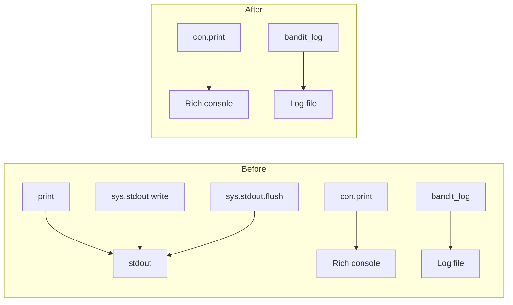

# Design Document: Standardize Logging

## Overview

This feature standardizes all output in `Bandit/bandit.py` by replacing bare `print()` calls and direct `sys.stdout.write()`/`sys.stdout.flush()` calls with the two established output channels:

- **Rich console (`con.print()`)** for user-facing messages with markup
- **Python logger (`bandit_log`)** for persistent log records

The refactoring is localized to the `extract()` function in a single file. No new modules, classes, or functions are introduced. The existing `con` and `bandit_log` instances are already initialized at module level and used extensively throughout the file — this change simply makes their usage consistent by eliminating the five remaining non-standard output calls.

### Design Decisions

1. **No new abstractions**: The file already has `con` and `bandit_log` set up correctly. The fix is mechanical — replace each non-standard call with the appropriate existing channel. Adding a wrapper or helper would over-engineer a simple refactoring.

2. **Dual-channel for errors and warnings**: Error messages go to both `con.print()` (for immediate user visibility with red markup) and `bandit_log.error()` (for log file persistence). This matches the pattern already established in the config validation block (lines 131–136).

3. **Rich Rule for separators**: The bare `print('-'*40)` separator is replaced with `con.print(Rule())` from the Rich library, which produces a styled horizontal rule that respects console width and theming.

4. **Remove `sys` import**: After eliminating `sys.stdout.write()` and `sys.stdout.flush()`, the `sys` module has no remaining references in the file. The import is removed to keep dependencies accurate.

## Architecture

The architecture is unchanged. The refactoring only modifies how five specific lines produce output, routing them through the existing `con` and `bandit_log` channels.



All output flows through exactly two channels after the refactoring.

## Components and Interfaces

No new components or interfaces are introduced. The changes are limited to five call sites in the `extract()` function within `Bandit/bandit.py`.

### Change Inventory

Each change below identifies the exact current code and its replacement.

#### Change 1: Invalid job directory error (line ~118)

**Current:**
```python
print(f'ERROR: Invalid jobs directory: {str(job_dir)}')
```

**Replacement:**
```python
con.print(f'[red]ERROR[/]: Invalid jobs directory: {str(job_dir)}')
bandit_log.error(f'Invalid jobs directory: {str(job_dir)}')
```

**Rationale:** This is an error condition. It should use dual-channel output: Rich console with red ERROR markup for the user, and logger at ERROR level for the log file. Matches the pattern used in the config validation block.

#### Change 2: Blank line after parameter file write (lines ~323–324)

**Current:**
```python
if verbose:
    sys.stdout.write('\n')
sys.stdout.flush()
```

**Replacement:**
```python
if verbose:
    con.print('')
```

**Rationale:** The `sys.stdout.write('\n')` produces a blank line for visual spacing. `con.print('')` achieves the same effect through the Rich console. The unconditional `sys.stdout.flush()` is no longer needed — Rich handles its own flushing. The flush outside the `if verbose` block served no purpose when verbose was false (nothing was written), so the entire block collapses into a single conditional `con.print('')`.

#### Change 3: Dynamic parameter verbose message (line ~419)

**Current:**
```python
print(f'Writing dynamic parameter {cparam}')
```

**Replacement:**
```python
con.print(f'[green4]INFO[/]: Writing dynamic parameter {cparam}')
```

**Rationale:** This is a verbose informational message about a processing step. It follows the same `[green4]INFO[/]` pattern used by other verbose messages in the file (e.g., "Writing parameter file for PRMS ...").

#### Change 4: Shapefile separator (line ~497)

**Current:**
```python
print('-'*40)
```

**Replacement:**
```python
from rich.rule import Rule
# (import added at top of file)
con.print(Rule())
```

**Rationale:** The repeated-dash separator is replaced with a Rich `Rule()`, which renders a styled horizontal line that adapts to console width. This is the idiomatic Rich approach for visual separators.

#### Change 5: Remove `sys` import (line ~7)

**Current:**
```python
import sys
```

**Replacement:** Line removed entirely.

**Rationale:** After changes 2, `sys` has no remaining references in the file. The `import` statement is removed to keep the module's imports accurate.

#### Addition: Import `Rule` from Rich (top of file)

**New import added:**
```python
from rich.rule import Rule
```

**Rationale:** Needed for Change 4 (the separator replacement).

### Summary of Changes

| # | Location | Current Code | New Code | Channel |
|---|---|---|---|---|
| 1 | ~line 118 | `print(f'ERROR: ...')` | `con.print(f'[red]ERROR[/]: ...')` + `bandit_log.error(...)` | Dual |
| 2 | ~lines 323–324 | `sys.stdout.write('\n')` / `sys.stdout.flush()` | `con.print('')` | Console |
| 3 | ~line 419 | `print(f'Writing dynamic parameter ...')` | `con.print(f'[green4]INFO[/]: ...')` | Console |
| 4 | ~line 497 | `print('-'*40)` | `con.print(Rule())` | Console |
| 5 | line 7 | `import sys` | *(removed)* | — |
| 6 | imports | — | `from rich.rule import Rule` | — |

## Data Models

No data models are introduced or modified. The refactoring changes only how existing string messages are routed to output channels.

## Error Handling

Error handling behavior is preserved. The only change is the output mechanism:

- The invalid job directory error (Change 1) currently calls `print()` then `exit(-1)`. After the change, it calls `con.print()` and `bandit_log.error()` then `exit(-1)`. The exit behavior is unchanged.
- No new error conditions are introduced.
- No existing error handling paths are altered beyond their output method.

## Testing Strategy

### Why Property-Based Testing Does Not Apply

This feature is a mechanical code refactoring — replacing five specific output calls with equivalent calls through different APIs. The changes are:

- **Deterministic**: Each call site produces the same output regardless of input variation
- **Not input-dependent**: The output channel choice doesn't vary with data
- **Localized**: Five specific lines in one file, with no new logic or branching

There are no universal properties that hold "for all inputs" — the correctness criterion is simply "these specific lines use these specific APIs." This is best verified through example-based tests and static analysis.

### Test Approach

**Static analysis tests** (AST inspection of `bandit.py`):

| Test | Verifies |
|---|---|
| No bare `print()` calls in `extract` | Requirements 1.3, 2.2 |
| No `sys.stdout.write()` calls | Requirement 3.1 |
| No `sys.stdout.flush()` calls | Requirement 3.2 |
| No `import sys` statement (or `sys` not referenced) | Requirement 6.1 |

These tests parse the AST of `bandit.py` and walk the tree to verify the absence of prohibited call patterns. They are resilient to formatting changes and don't require mocking the full extraction pipeline.

**Example-based unit tests** (with mocking):

| Test | Verifies |
|---|---|
| Invalid job_dir triggers `con.print` with `[red]ERROR[/]` and `bandit_log.error` | Requirements 1.1, 1.2, 4.1 |
| Verbose dynamic parameter message uses `con.print` with `[green4]INFO[/]` | Requirements 2.1, 4.3 |
| Shapefile separator uses `con.print(Rule())` | Requirement 2.3 |
| Verbose blank line uses `con.print('')` | Requirement 3.3 |
| Existing `bandit_log` calls unchanged (spot check) | Requirement 5.1 |
| Existing `con.print` calls unchanged (spot check) | Requirement 5.2 |

**Test framework**: `pytest` (already in dev dependencies)

**Test file location**: `tests/test_standardize_logging.py`

### Preservation verification

Requirements 5.1–5.3 (preserve existing patterns) are primarily verified through code review of the diff. The AST-based tests provide an automated safety net by confirming that no prohibited patterns exist, and the example-based tests confirm the new patterns are correct. Together, these ensure the refactoring is both complete (no old patterns remain) and correct (new patterns match expectations).
